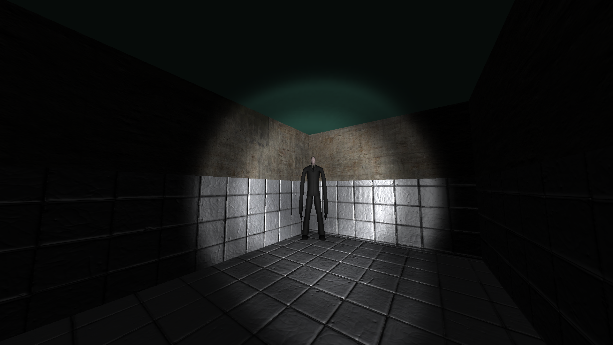
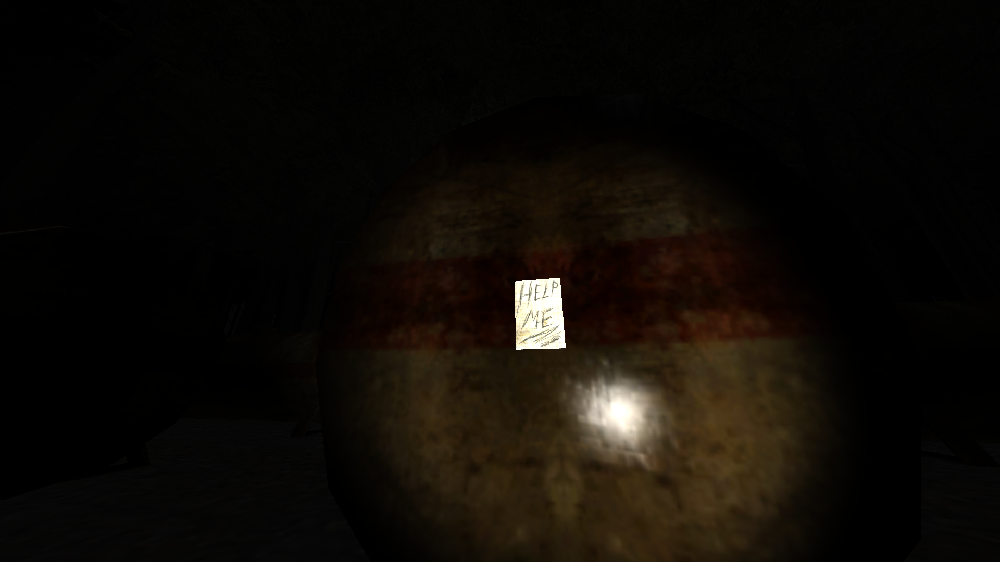

# Slender: The Eight Pages - OpenGL Recreation

A fan-made OpenGL recreation of the classic indie horror experience "Slender: The Eight Pages." The goal of the project is to implement the core gameplay loop, exploring a dark forest, finding eight pages, and surviving encounters with the stalking entity using modern OpenGL techniques.

> **Note:** This is an unofficial, fan-made project and is not affiliated with or endorsed by the original creators of Slender: The Eight Pages.

## Features

- **Entity Component System (ECS)** — Flexible, data-driven architecture
- **Blinn-Phong Lighting** — With normal mapping and specular highlights
- **Instanced Rendering** — Efficient vegetation (trees, grass) rendering
- **Physics** — Bullet Physics integration for collision detection
- **Adaptive AI** — Slenderman difficulty scales with pages collected and time played
- **Flashlight Cookie** — Projected spotlight texture for realistic flashlight effect
- **Postprocessing** — Static noise, vignette, and health-based visual effects
- **Audio** — Sounds for immersive atmosphere
- **Config-Driven** — Levels and assets defined in JSON for easy customization

## Gameplay

You explore a dimly-lit forest searching for eight pages scattered across the map. A mysterious, unkillable entity stalks you, look at him for too long or get too close and you die. The objective is to collect all eight pages before the entity kills you.

## Screenshots





## Controls

For custom mappings, see `config/player.json` or the settings menu.

| Action | Key |
|--------|-----|
| Move | `W` `A` `S` `D` |
| Sprint | `Left Shift` |
| Look | Mouse |
| Toggle Flashlight | `F` |
| Interact / Pick up page | `Left Click` |
| Pause / Menu | `Esc` |

## Requirements

- Windows 10/11
- OpenGL 3.3+ compatible GPU
- ~200MB disk space

## Quick Start (Windows)

### Release:

Just launch `Slender.exe`.

### If already built:

```powershell
cd bin
.\Slender.exe -c ../config/app.jsonc
```

## Build Instructions (VS Code)

1. **Install prerequisites:**
   - [CMake](https://cmake.org/download/)
   - [Visual Studio Build Tools](https://visualstudio.microsoft.com/downloads/)
   - VS Code extensions: *CMake Tools* & *C/C++*

2. **Open the project:**
   Open the folder containing `CMakeLists.txt` in VS Code.

3. **Configure & Build:**
   - `Ctrl+Shift+P` → **CMake: Configure**
   - `Ctrl+Shift+P` → **CMake: Build**

4. **Run:**
   ```powershell
   cd bin
   .\Slender.exe -c ../config/app.jsonc
   ```

## Project Layout

| Directory | Description |
|-----------|-------------|
| `source/` | Application and engine source code (entry: `main.cpp`) |
| `assets/` | Models, textures, shaders, sounds |
| `assets/shaders/` | GLSL vertex and fragment shaders |
| `config/` | JSON scene, entity, and material definitions |
| `vendor/` | Third-party libraries (GLFW, GLAD, GLM, ImGui, Bullet, etc.) |
| `build/` | CMake intermediate files (git-ignored) |
| `bin/` | Compiled executable output |

## Credits

- Original *Slender: The Eight Pages* by Parsec Productions
- Libraries: GLFW, GLAD, GLM, stb_image, Bullet Physics, ImGui, miniaudio
